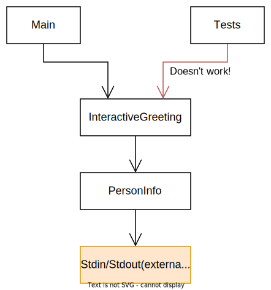
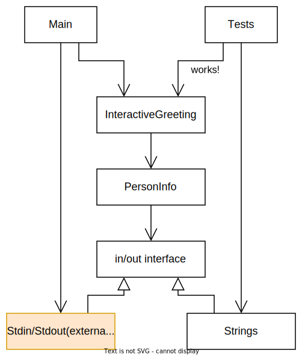
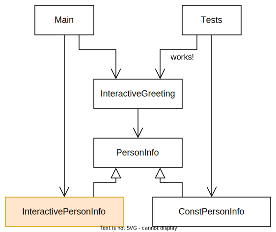
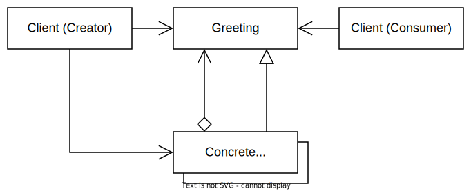

# Introduction

This project has some example code to practice refactoring.

# The goal

The code works when run, but the tests are currently failing because the code is not designed to be testable.

The goal is to redesign the main code so that the tests pass.

It's expected that you will need to change the tests slightly, not only the production code. The main code is so bad that pure refactoring (that doesn't change behaviour nor tests) is not possible.

# How to run

The main application uses stdin and stdout for simple input and output.
To run the application in the terminal, use the following command:
```
./gradlew run --console plain
```

Alternatively, if you are using Intellij or Android Studio, you can click the "Run" button in the gutter next to the main method in `App.kt`.

# Suggested solutions

**SPOILER ALERT**

It is strongly recommended that you try to solve the problems yourself before reading the suggested solutions below.


## GreetingFromConfig

The GreetingFromConfig code is problematic for several reasons, but the solution suggested is to just use a non-singleton class that is only instantiated once in the main function, and that instance is passed to all places that need access.

The "there should be only one instance" constraint is not (and should not be in most cases) enforced by the compiler because tests benefit from being able to create multiple instances of the class.

## GreetingFromComplexConfig

This is similar to the previous problem, but the structure is more complicated to support some extra requirements which make the refactoring more interesting.

## InteractiveGreeting

The problem presented here is the fact that a class uses external resources (stdin, stdout) and that makes it hard to test. Both presented solutions make some kind of interface layer that is implemented by the actual external resources and by a fake implementation that can be used in tests.

In this example the main external resource is stdin, but the same reasoning would apply with other resources like a database, a network connection, a screen with buttons shown to the user, etc.

Here is a simplified class diagram of the problem:



Here is the solution that takes a BufferedReader and a PrintStream to allow substituting the external resources with fake ones:



And here is the solution that uses a PersonInfo interface. This is kind of a Strategy design pattern, where we choose the implementation of PersonInfo depending on the situation (production code or tests):



In different situations, one approach might be better than the other. The first solution is arguably more complex, but it allows a higher testing coverage. The second solution is maybe simpler with more boilerplate code, but doesn't allow testing some of the logic that is close to the external resources.

In general, you should prefer the design that moves the usage of external resources as outside as possible, but you should consider the tradeoffs.

## NestedGreeting

The challenge in this problem is how to design the implementation, given some tests that show the rough requirements. The requirements are complicated enough that trivial flags will not be enough.

The suggested solution is to use a decorator pattern. A concrete decorator is a wrapper to another instance of the same decorator interface, where each decorator adds some extra logic.

The suggested solution could also be called a composite pattern. The difference between a decorator and a composite is that a decorator focuses on adding behaviour and has a single child, while a composite focuses on aggregating multiple children without adding logic.

