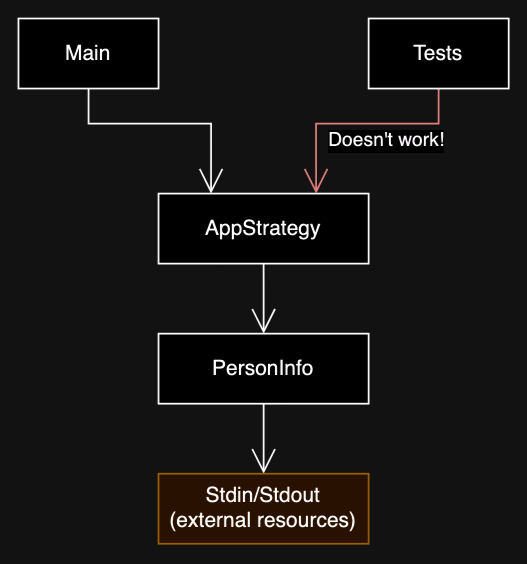
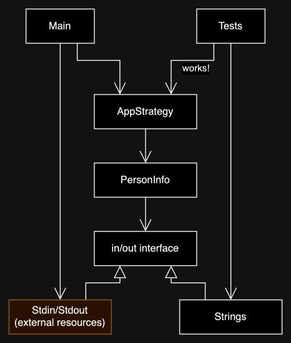
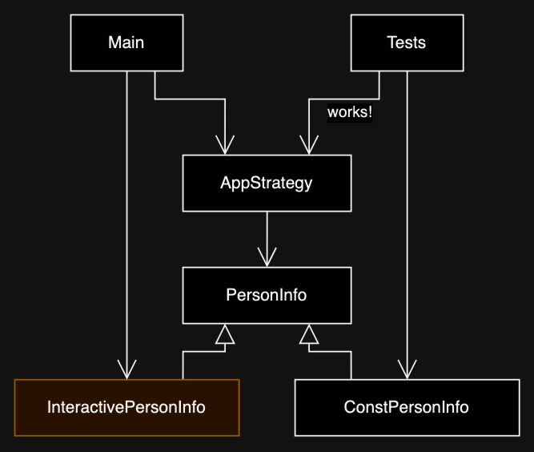

# Introduction

This project has some example code to practice refactoring.

# How to run

The main application uses stdin and stdout for simple input and output.
To run the application in the terminal, use the following command:
```
./gradlew run --console plain
```

Alternatively, if you are using Intellij or Android Studio, you can click the "Run" button in the gutter next to the main method in `refactoring.App.kt`.

# Solutions explained

## Singleton

The singleton implementation was problematic for several reasons, but the solution suggested is to just use a regular class that is only instantiated once in the main function, and that instance is passed to all places that need access.

The "there should be only one instance" constraint is not (and should not be in most cases) enforced by the compiler because tests benefit from being able to create multiple instances of the class.

## Strategy

The problem presented here is the fact that a class uses external resources (stdin, stdout) and that makes it hard to test. Both presented solutions make some kind of interface layer that is implemented by the actual external resources and by a fake implementation that can be used in tests.

Here is a simplified class diagram of the problem:



Here is the solution that takes a BufferedReader and a PrintStream to allow substituting the external resources with fake ones:



And here is the solution that uses a PersonInfo interface:

